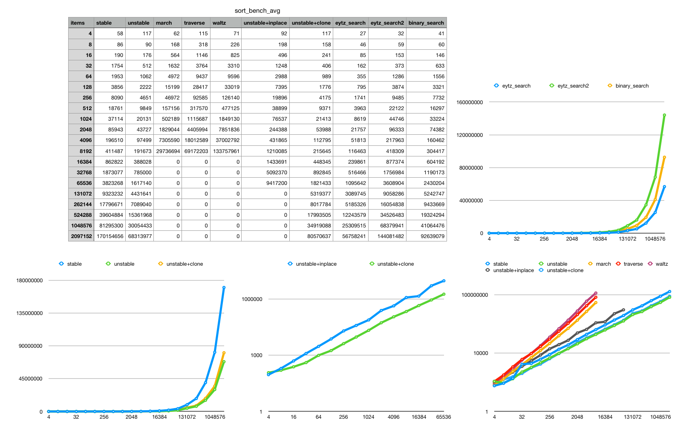

# This repository documents my work on evaluating and comparing search and sorting algorithms.

# Search

I implemented a simple find first element algorithm in a slice which is sorted in [Eytzinger order](https://en.wikipedia.org/wiki/Implicit_data_structure).
The simple algorithm performs faster (in some cases multiple times faster), then the Rust `stdlib` `binary_search` algorithm.
I also compared a `eytzinger_search` method from `eytzinger` [crate](https://docs.rs/eytzinger/1.0.1/eytzinger/). Which performed worse then `binary_search` and my `first_index_for_eytzinger` function.

# Sorting

## Ascending order
In order to find elements in a slice with binary search the slice has to be sorted in ascending order.
Rust `std` library provides two options for sorting - `sort` and `sort_unstable` methods on a `Slice`. The `sort_unstable` method is mostly faster then `sort`.

## Eytzinger order
We have four options how a random slice of `PartialOrd` elements can conform to Eytzinger order:
1. Sorting algorithm, which mutates the slice in place.
2. Sorting algorithm, which produces a new array conforming to Eytzinger order from the given random slice.
3. Presorting the slice and than transforming it into Eytzinger order in place.
4. Presorting the slice and than creating a new array conforming to Eytzinger array order from the sorted slice.

I spent multiple attempts trying to implement the first option. As a result Eytzinger March, Eytzinger Waltz and Eytzinger Traversal sort where implemented. But all three algorithms have sub optimal performance characteristics.

I did not tried to implement option number two. I used the algorithm from `eytzinger` [crate](https://docs.rs/eytzinger/1.0.1/eytzinger/) as option three. And implemented option four based on a functions from `eytzinger` [crate](https://docs.rs/eytzinger/1.0.1/eytzinger/).

I compared the result to each other and also to `std` `sort` and `sort_unstable`.

Following diagram shows data based on sorting and searching in a random `Vec<u64>`.

The values are nano seconds. 

